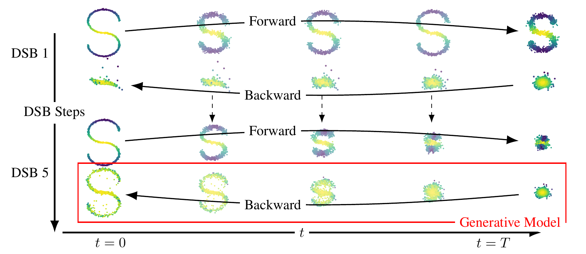
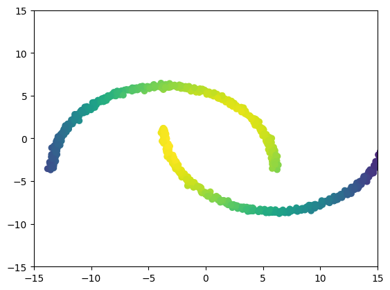
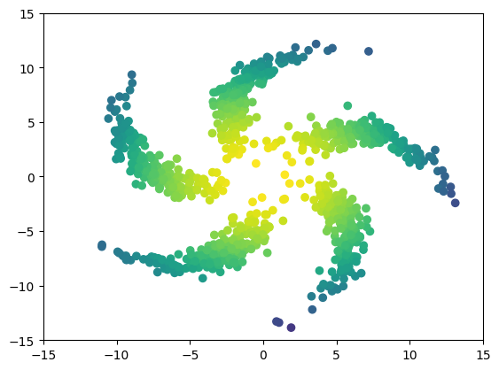
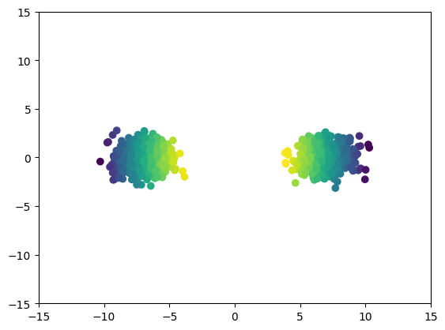
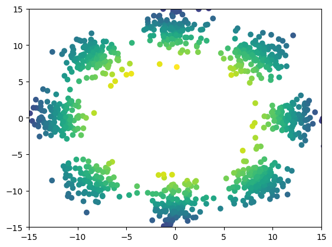
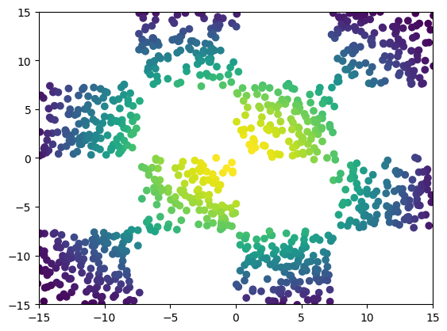

# Diffusion Schr&ouml;dinger Bridge with Applications to Score-Based Generative Modeling

This repository contains the implementation for the paper Diffusion
Schr&ouml;dinger Bridge with Applications to Score-Based Generative Modeling.

Contributors
------------

* ???

What is a Schr&ouml;dinger bridge?
-----------------------------

The Schr&ouml;dinger Bridge (SB) problem is a classical problem appearing in
applied mathematics, optimal control and probability; see [1, 2, 3].  In the
discrete-time setting, it takes the following (dynamic) form. Consider as
reference density p(x0:N) describing the process adding noise to the
data.  We aim to find p\*(x0:N) such that p\*(x0) =
pdata(x0) and p\*(xN) =
pprior(xN) and minimize the Kullback-Leibler divergence
between p\* and p. In this work we introduce **Diffusion Schrodinger Bridge**
(DSB), a new algorithm which uses score-matching approaches [4] to
approximate the *Iterative Proportional Fitting* algorithm, an iterative method
to find the solutions of the SB problem. DSB can be seen as a refinement of
existing score-based generative modeling methods [5, 6].

Code
------------

Code available [here](https://github.com/anon284/schrodinger_bridge)

Two dimensional examples
------------------------

  
   

  
   

  
   

  
   

  
   

  
   

  
   

  
   

CelebA example
--------------

MNIST example
--------------

Dataset interpolation
--------------

  
  
  

  
  
  

  
  
  

References
----------

.. [1] Hans F&ouml;llmer
       *Random fields and diffusion processes*
       In: École d'été de Probabilités de Saint-Flour 1985-1987

.. [2] Christian Léonard 
       *A survey of the Schr&ouml;dinger problem and some of its connections with optimal transport*
       In: Discrete & Continuous Dynamical Systems-A 2014

.. [3] Yongxin Chen, Tryphon Georgiou and Michele Pavon
       *Optimal Transport in Systems and Control*
       In: Annual Review of Control, Robotics, and Autonomous Systems 2020

.. [4] Aapo Hyv&auml;rinen and Peter Dayan
       *Estimation of non-normalized statistical models by score matching*
       In: Journal of Machine Learning Research 2005

.. [5] Yang Song and Stefano Ermon
       *Generative modeling by estimating gradients of the data distribution*
       In: Advances in Neural Information Processing Systems 2019

.. [6] Jonathan Ho, Ajay Jain and Pieter Abbeel
       *Denoising diffusion probabilistic models*
       In: Advances in Neural Information Processing Systems 2020
